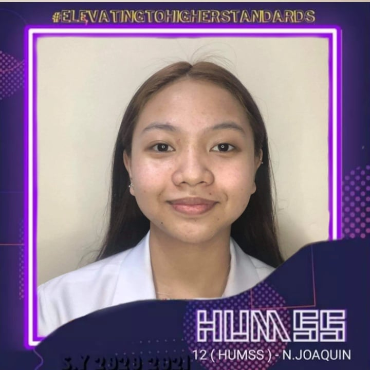
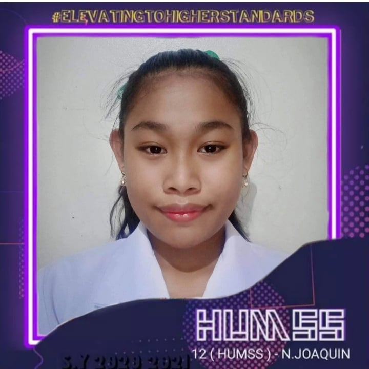
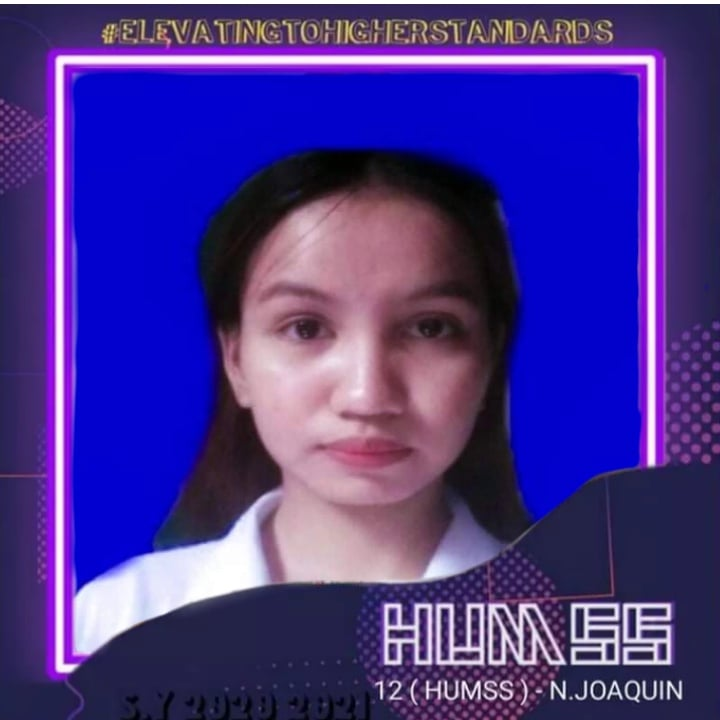
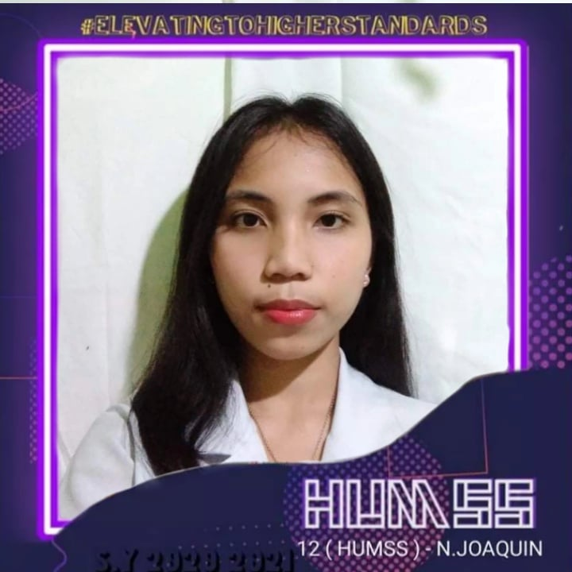
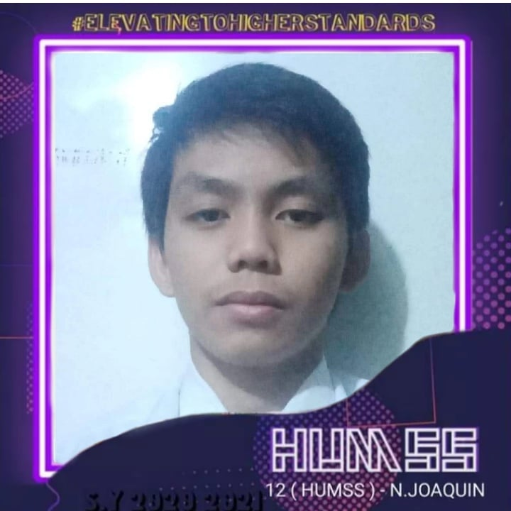
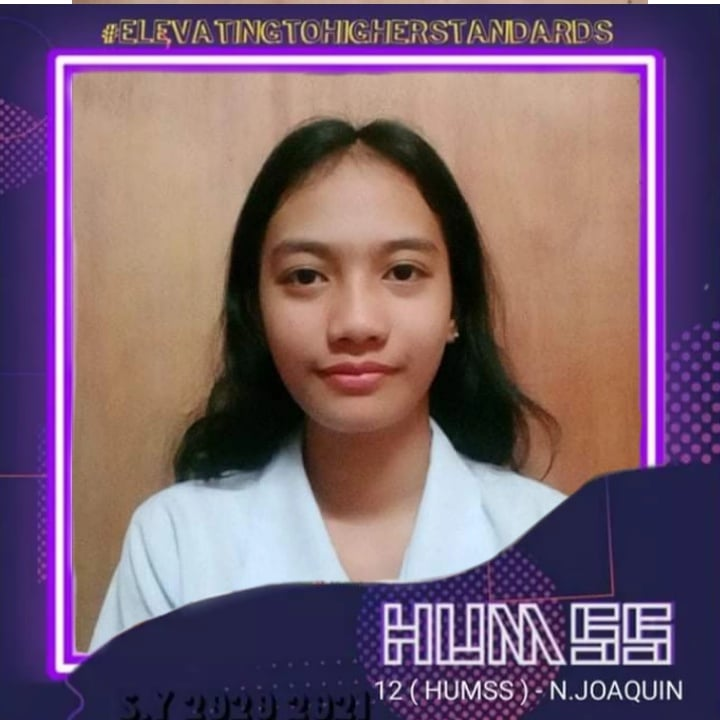
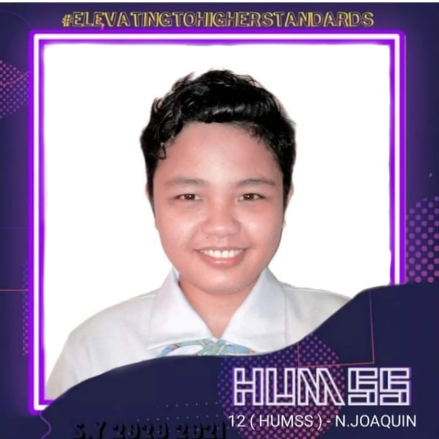
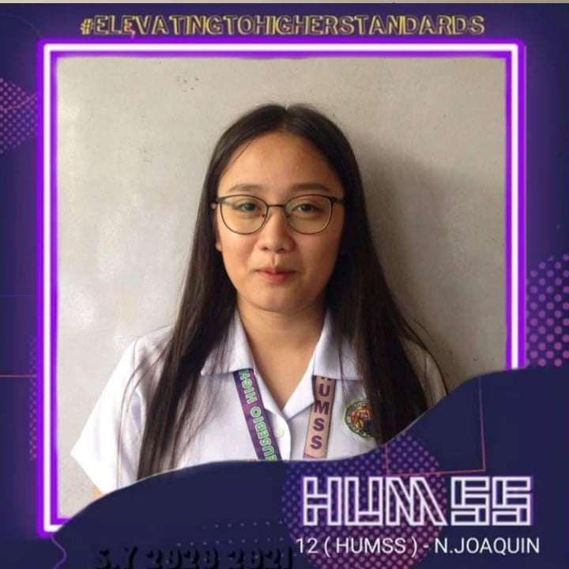
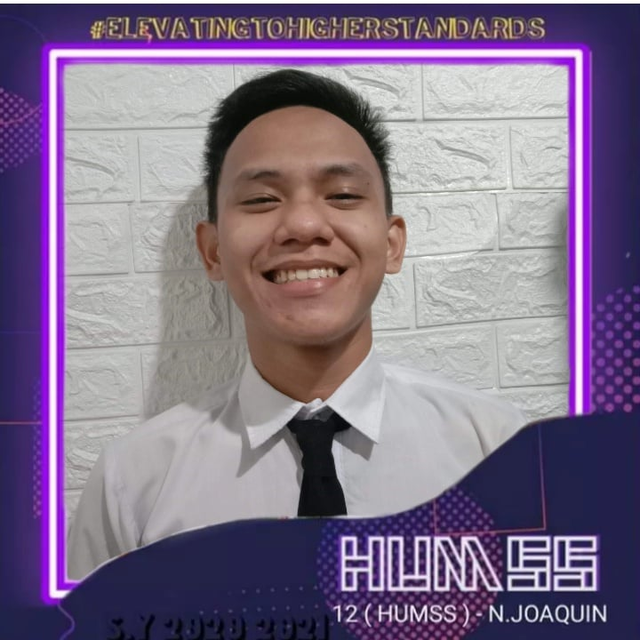

<!DOCTYPE html>
<html>
<head>
	<meta charset="utf-8">
	<meta name="viewport" content="width=device-width, initial-scale=1">
	<title>E-PASSible</title>
	
	
</head>
<body>
	<header>
		
E-PASSIBLE

		<nav>
			<ul>
				<li><a href="#">HOME</li>
				<li><a href="#">ASSIGNMENT</li>
				<li><a href="#">PROJECTS</li>
				<li><a href="#">ABOUT US</li>
				<li><a href="#">CONTACT US</li>
			</ul>
		</nav>
	</header>
	

		<h1>Empowerment Technology E-Portfolio</h1>
		
Enhance your output accomplishing experience

	

	

		<h3>ABOUT US</h3>
		<h6>We are the students from Eusebio High School under Humanities and Social Sciences  Grade 12 Section Nick Joaquin.</h6>

		
		
Paula Embuestro
  
		
		
Gly Lopina
  
		
		
Kyla Macaspac
  
		
		
Seahtiel Maybuena
  
		
		
Ivan Peñarila
  
		
		
Darielou Roquid
  
		
		
Vernica Tarle
  
		
		
Lailane Tolentino
  
		
		
Acer Umbal
  

	

	<footer>
		 This work is licensed under a <a rel="license" href="http://creativecommons.org/licenses/by/4.0/">Creative Commons Attribution 4.0 International License</a>.
	</footer>

</body>
</html>
